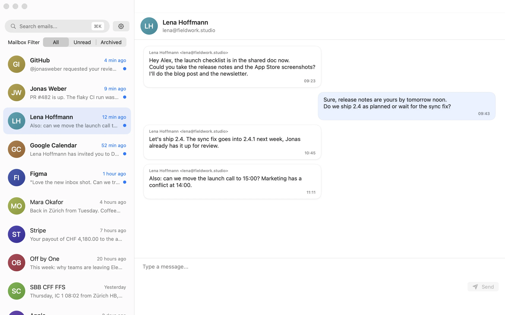
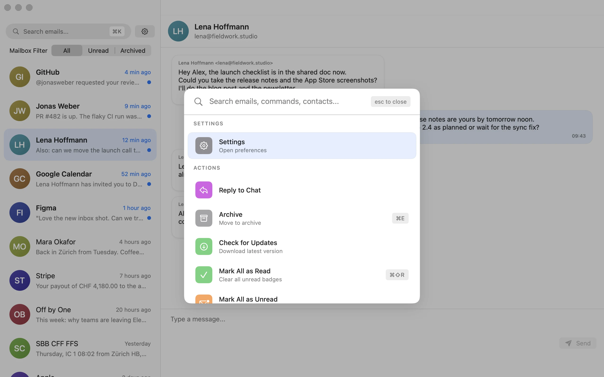

# PowerUserMail

A keyboard-first, native macOS email client — command palette, shortcuts, and zero distractions. An open alternative inspired by Superhuman-style workflows.

<picture>
  <source media="(prefers-color-scheme: dark)" srcset="docs/screenshots/inbox-dark.webp">
  
</picture>

Mail reads like a chat: everyone who writes to you is one conversation, newest on top.

Everything is one search away in the command palette (⌘K):

<picture>
  <source media="(prefers-color-scheme: dark)" srcset="docs/screenshots/palette-dark.webp">
  
</picture>

## Features

- Native SwiftUI shell with fast keyboard navigation
- Command palette (⌘K) for search and actions
- Conversations grouped by person, with All / Unread / Archived filters (⌘1 / ⌘2 / ⌘3)
- Gmail, Outlook and IMAP accounts
- Keychain-backed credentials

## Requirements

- macOS with Xcode matching the project deployment target
- See [CONTRIBUTING.md](CONTRIBUTING.md) for branch workflow and releases

## Build

```sh
make build
make test
make run
```

## Screenshots

The images above are the real app running a built-in sample mailbox. To recapture them (dark and light):

```sh
scripts/screenshots.sh        # writes docs/screenshots/*.webp
```

It never clicks, types or records your screen, so it runs fine on a busy or locked Mac. It builds the app under a separate bundle ID and launches it with `PUM_DEMO=1`: the app shows the sample inbox instead of your accounts, keeps mail, accounts and settings in memory, and never signs in, touches the keychain, goes online or sends notifications. More variables pick what is on screen:

| Variable | Effect |
| --- | --- |
| `PUM_DEMO_THEME=dark\|light` | Force the appearance |
| `PUM_DEMO_WINDOW=1280x800` | Window size |
| `PUM_DEMO_FILTER=all\|unread\|archived` | Inbox filter |
| `PUM_DEMO_OPEN=Lena` | Open the conversation with that sender |
| `PUM_DEMO_PALETTE=1` | Show the command palette |
| `PUM_DEMO_CAPTURE=out.png` | Draw the window into a PNG and quit (needs a build without the sandbox, as the script makes) |

The sample mail lives in `PowerUserMail/Services/DemoMailService.swift`.

## Support development

If PowerUserMail saves you time:

- [Buy Me a Coffee](https://buymeacoffee.com/isaaclins)
- [isaaclins.com](https://isaaclins.com)

## License

See [LICENSE](LICENSE).
